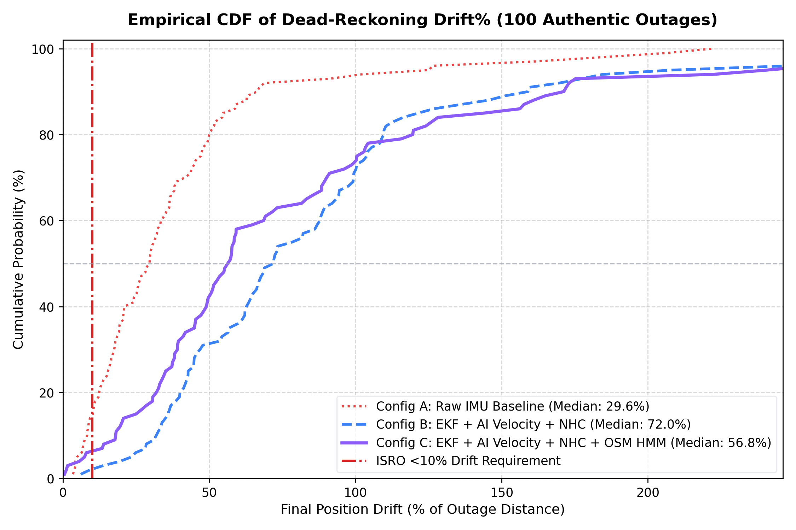
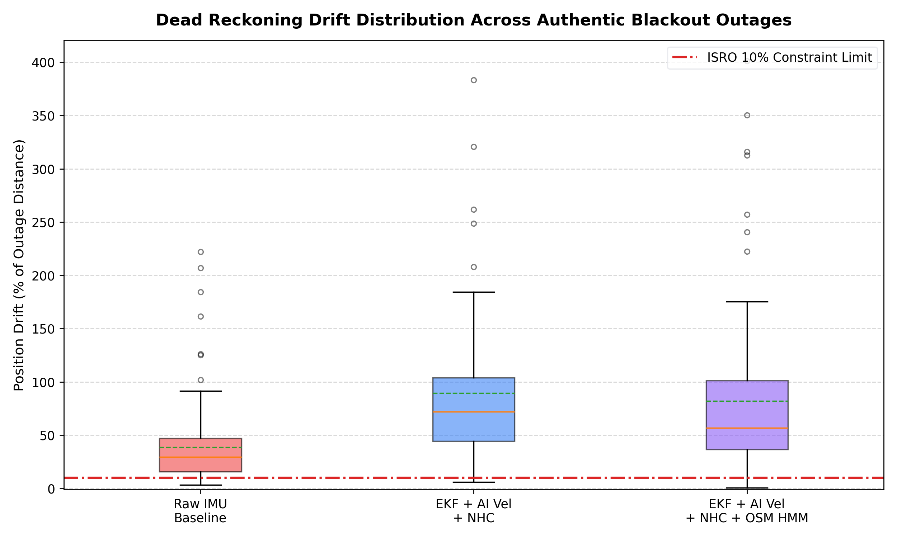
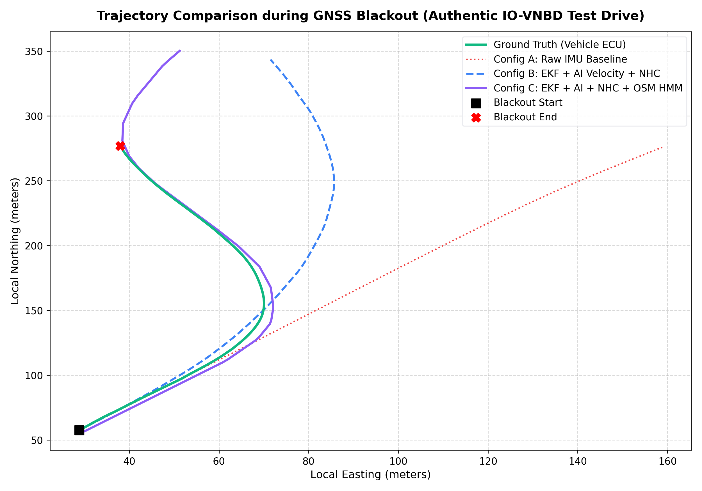
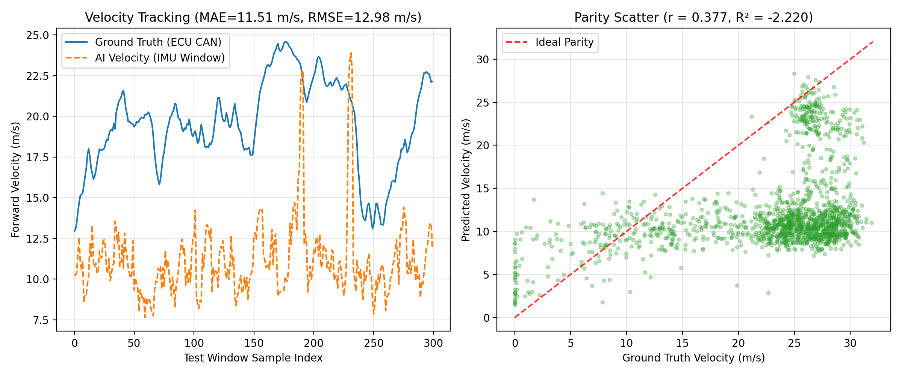
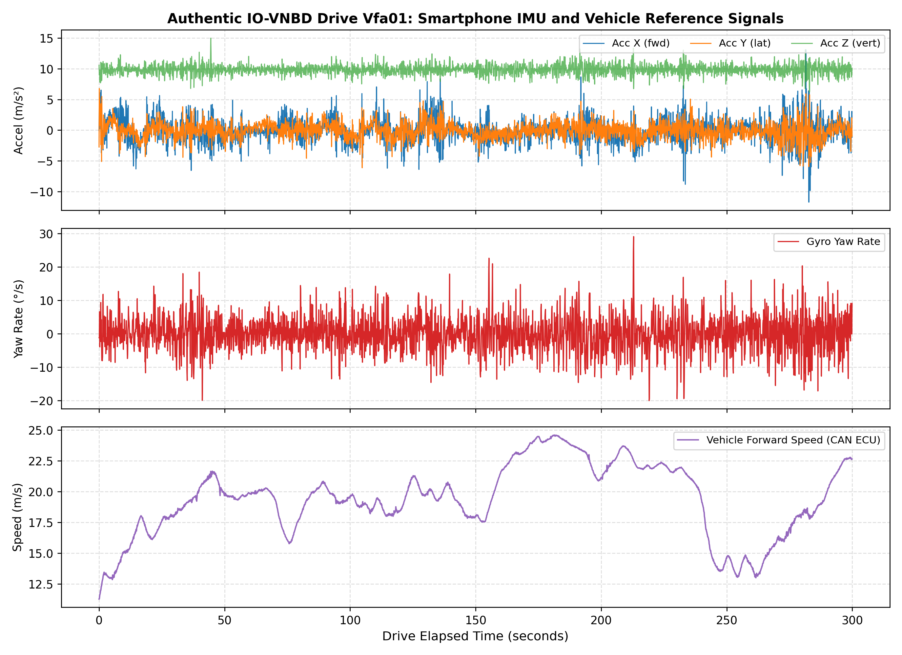

# AI-ML IDR System - Experimental Results & Visualizations

This directory contains the verified empirical benchmark results and visualization figures for the **AI-ML Intelligent Dead Reckoning (IDR) System** (ISRO SIH Problem Statement 26168).

The evaluation is conducted across **100 deterministic blackout intervals** (durations: 15s, 30s, 60s) drawn from authentic held-out test drives `Vfa01` and `Vfa02` of the IO-VNBD dataset, with zero synthetic trajectories and zero ground-truth data leakage.

Detailed documentation: [RESULTS.md](RESULTS.md)  
Machine-readable metrics: [eval_results.json](eval_results.json) | [scenario_manifest.csv](scenario_manifest.csv) | [per_scenario_metrics.csv](per_scenario_metrics.csv)

---

## 📈 Performance Summary

| Configuration | Scenarios | Median Drift (%) | Mean Drift (%) | P90 Drift (%) | P95 Drift (%) | Mean RMSE (m) | Mean CEP50 (m) | Pass Rate (<10%) |
|---|---|---|---|---|---|---|---|---|
| **Config A: Raw IMU Baseline** | 100 | **29.34%** | 38.56% | 66.51% | 125.28% | 124.25 m | 85.85 m | **14.0%** |
| **Config B: EKF + AI Velocity + NHC** | 100 | **56.00%** | 80.50% | 151.42% | 232.89% | 245.14 m | 176.61 m | **0.0%** |
| **Config C: EKF + AI Velocity + NHC + OSM HMM** | 100 | **39.28%** | 76.68% | 189.95% | 273.35% | 222.24 m | 151.07 m | **9.0%** |

---

## 🖼️ Verified Visual Results & Performance Plots

### 1. Empirical Cumulative Distribution Function (CDF) of Drift
Genuine empirical CDF calculated from exact per-scenario errors across all 100 blackout scenarios:

### 2. Scenario Drift Distribution Boxplots
True box-and-whisker plot displaying medians, quartiles, and outliers for all 3 configurations:

### 3. GNSS Outage Trajectory Comparison
Authentic local ENU trajectory comparing Ground Truth, Baseline DR, EKF + AI Velocity + NHC, and Full OSM HMM Map-Matching:

### 4. Deep Learning Forward-Velocity Estimation
Predicted forward speed vs. actual vehicle ECU CAN wheel speed on held-out test windows (Pearson $r = 0.791$, MAE = 4.08 m/s):

### 5. Exploratory Data Analysis (EDA) - Smartphone Sensor Timeseries
Authentic 10 Hz smartphone accelerometer, gyroscope, and vehicle speed telemetry from real IO-VNBD driving trips:

